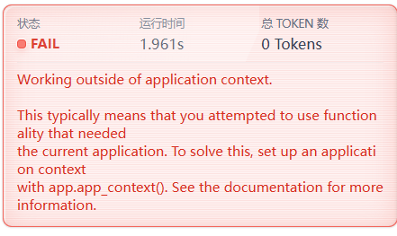
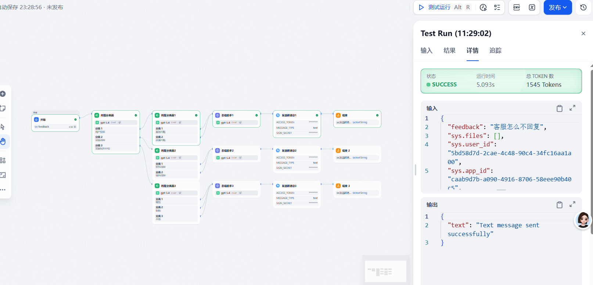
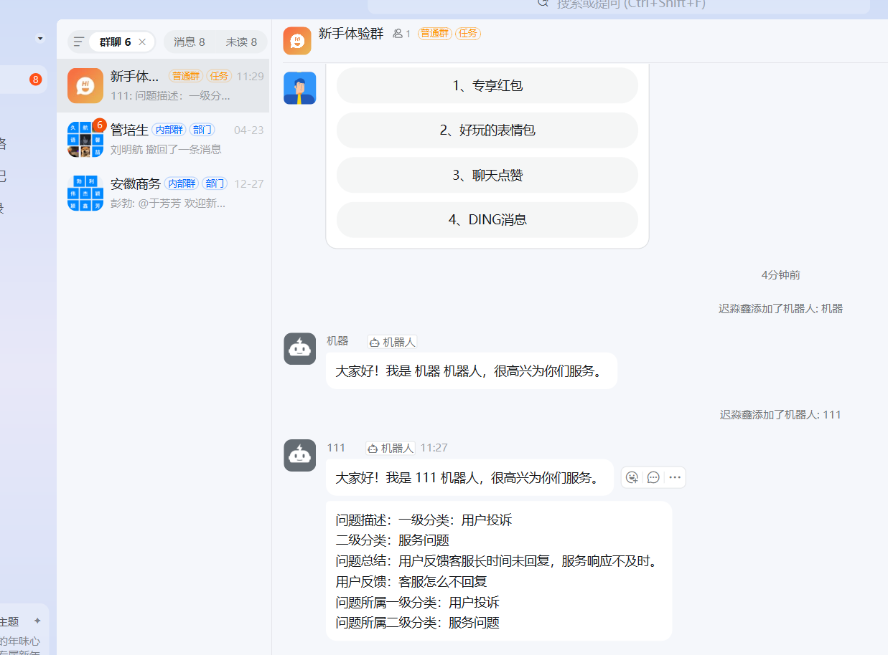
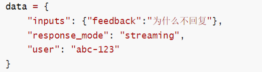

# Dify和Coze

## 案例

1.Coze 营销海报生成------------------了解了导入工作流项目和界面 ,从工作流方面分解各个逻辑流程

注意更换大模型,部分大模型在5月11日后就过期,注意修改,可以使用Coze来制作简易应用和智能体,工作流的过程有点类似编程中调用的方法

2.dify 一键生成行业调研报告---------------------了解到dify的使用方法,dify相对于Coze更难使用一点,方便使用国外的插件,列表使用迭代,在使用,出现此错误可以关闭并行模式,但是运行时间非常慢.批处理相当于迭代.

3.dify处理客户投诉钉钉-------------------------- 通过连接钉钉,使用工作流回复





4.coze客服对话记录分析---------------全工作流自行编写  主要逻辑

此应用包括两个工作流excel_preprocess和message_process

首先经由excel_preprocess处理为消息列表（list），然后message_process	

**首先经由excel_preprocess处理为消息列表（list），然后message_process从消息列表中提取信息，生成分析报告**。

message_process是通过对excel_preprocess工作流中的数据进行批处理分别使用情感分析内容总结问题分类的逻辑来得出最后结果

## Python连接coze和dify

coze---------------连接生成海报工作流,有直接的python代码直接粘贴即可,

```python
handle_workflow_iterator(
    coze.workflows.runs.stream(
        workflow_id=workflow_id,
        parameters={
    "BOT_USER_INPUT": "",
    "img": "{}",
    "prompt": "小女孩在喝汽水",
    "propotion": ""
  },
    )
)
```

核心修改此处,添加提示词

dify-----------------钉钉投诉处理

没有直接的python代码,根据shell命令修改

```python
import requests

api_key = "app-2r5B5Rj6lx4a92GzEMSY1Sqa"
url = "https://api.dify.ai/v1/workflows/run"

headers = {
    "Authorization": f"Bearer {api_key}",
    "Content-Type": "application/json"
}

data = {
    "inputs": {"feedback":"为什么不回复"},
    "response_mode": "streaming",
    "user": "abc-123"
}

# 流式接收返回
response = requests.post(url, headers=headers, json=data, stream=True)

for line in response.iter_lines():
    if line:
        print(line.decode("utf-8"))
```

输入在input中

