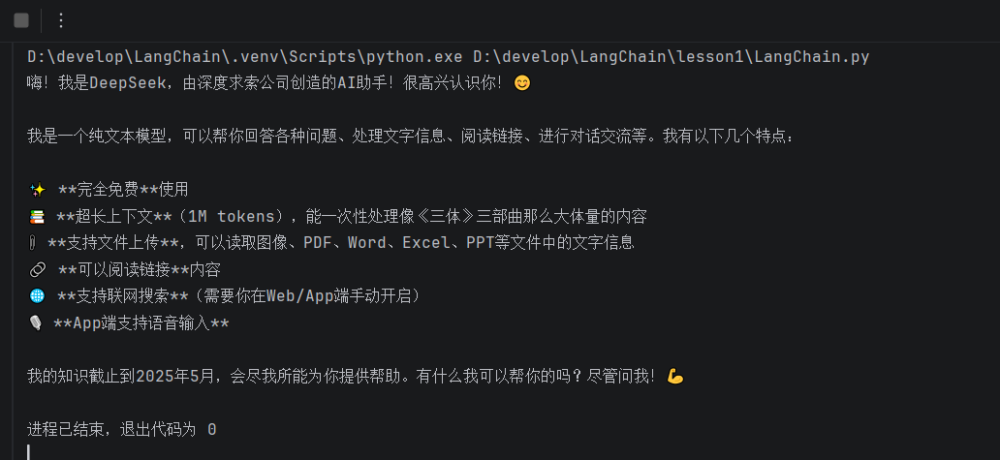
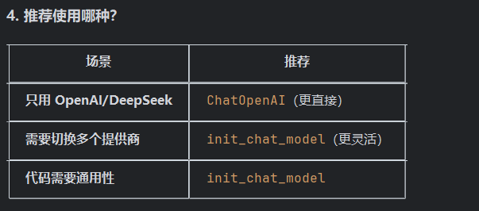

# Langchain入门

学习一个新知识,主要方法,官方文档,github

Langchain的定义相当于胶水,来连接外部世界和大模型

主要是六部分:1.Models(模型)

2.Memory(记忆)

3.Retrieval(检索)

4.Chains(链)

5.Agents(智能体)

6.Callback(回调)

在pycharm下载langchain

需要的话可以在一套系统中使用多个大模型

初试👇

```python
from langchain.chat_models import init_chat_model
from dotenv import load_dotenv
import os

from openai import api_key, base_url

model= init_chat_model(
    model="deepseek-v4-pro",
    model_provider="openai",
    api_key="sk-9f5095134676449cbeaa2982d2d77984",
    base_url="https://api.deepseek.com"     )
print(model.invoke("你是谁").content)
```



使用阿里云同样的道理去阿里云官网拷贝api_key和网址

#### 专业一点的代码

思路:1.首先定义环境变量

```python
load_dotenv(encoding='utf-8',override=True)
```

2.使用logging来输出日志

3.将创建大模型对象设置成函数,提升健壮性

4.使用main()中使用try catch来捕捉错误

#### 使用流式输出

```python
liu_llm= llm.stream("你能做什么")
for chunk in liu_llm:
    print(chunk.content, end="", flush=True)
```

#### ps

1.修改环境变量之后使用override=True来更新

```python
load_dotenv(encoding='utf-8',override=True)
```

2.nit_chat_model与ChatOpenAI的不同在于是否需要提供者(model_provider)

