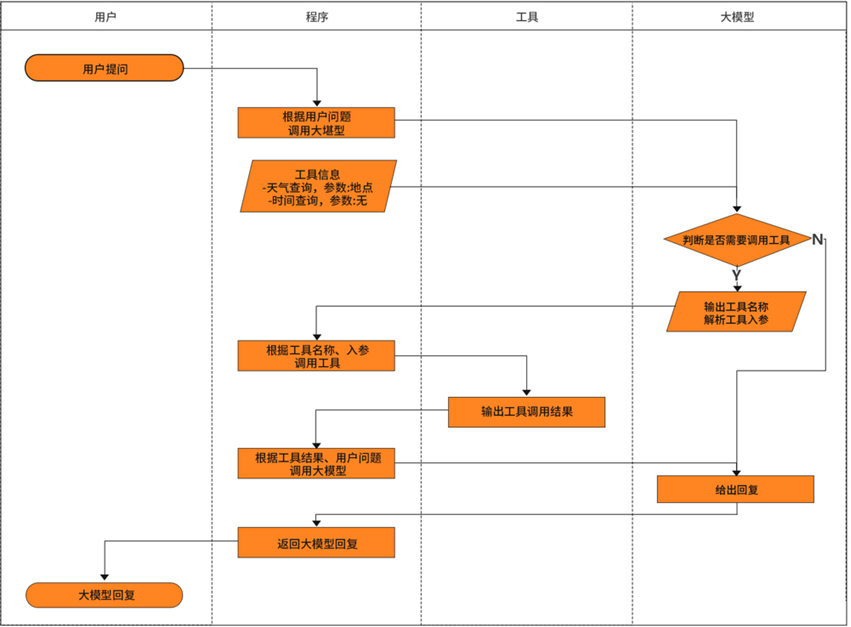

# Tools (Function Calling)工具调用

外挂工具让大模型使用来完成某些任务

通过 Tool（工具）机制，可以让模型具备“调用外部函数”的能力，使其能够与外部系统、API 或自定义函数交互，从而完成仅靠文本生成无法实现的任务

1.访问实时数据

2.执行某种工具类/辅助类操作

泳道图



## 天气查询示例

pydantic使用可以强制类型,不用担心python自己瞎转换

Pydantic = “类型注解 + 自动校验 + 转换”神器，让 Python 在运行时也能享受“静态类型”的安全感。

```python
class User(BaseModel):
    #id: int
    id: StrictInt  # 改用严格整数类型，拒绝类型转换
    name: str
    age: int = 0  # 可给默认值
```

分成两个.py文件

一个写工具

```python
@tool
def get_weather(text: str) -> str:
    """
    查询天气工具
    :param text:查询的城市
    :return:返回JOSN格式的天气信息
    """
    url = "https://api.openweathermap.org/data/2.5/weather"
    params= {
        "q": text,
        "appid": "5e950228baa199738b40bb66c979da3a",
        "units": "metric",
        "lang": "zh_cn"
    }
    response = httpx.get(url, params=params, timeout=30)
    data = response.json()
    return json.dumps(data)
```

有了@tool注解就可以使用invoke方法之类

运行代码  注意有的大模型不支持加工具类

```python
llm_with_tools = llm.bind_tools([get_weather])
```

大模型绑定工具

```python
parser = JsonOutputKeyToolsParser(key_name=get_weather.name, first_tool_only=True)
```

注意使用的构造方法是JsonOutputKeyToolsParser

```python
# 构建工具调用链：模型 -> 解析器 -> 调用天气工具
get_weather_chain = llm_with_tools | parser | get_weather
```

```python
output_prompt = PromptTemplate.from_template(
    """你将收到一段 JSON 格式的天气数据{weather_json}，请用简洁自然的方式将其转述给用户。
    以下是天气 JSON 数据：
    请将其转换为中文天气描述，例如：
    “北京现在天气：多云，气温 28℃，体感有点闷热（约 32℃），湿度 75%，微风（东南风 2 米/秒），
    能见度很好，大约 10 公里。建议穿短袖短裤。适合做户外运动。"
    """
)

# 创建字符串输出解析器
output_parser = StrOutputParser()

# 构建最终输出链：提示模板 -> 模型 -> 输出解析器
output_chain = output_prompt | llm | output_parser

# 构建完整的处理链：天气查询链 ->将天气数据包装为字典格式 -> 输出链
full_chain = get_weather_chain | (lambda x: {"weather_json": x}) | output_chain

# 执行完整链路，查询上海天气并打印结果
result = full_chain.invoke("beijing")
logger.info(result)
```