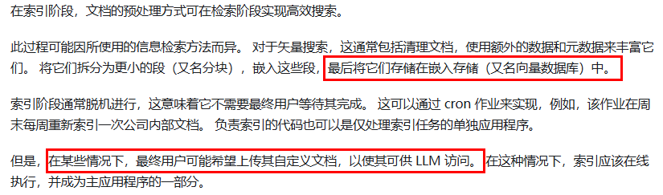
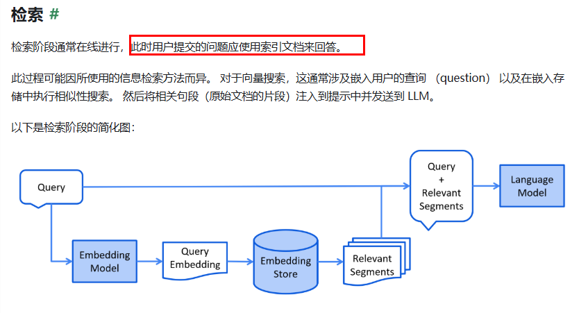
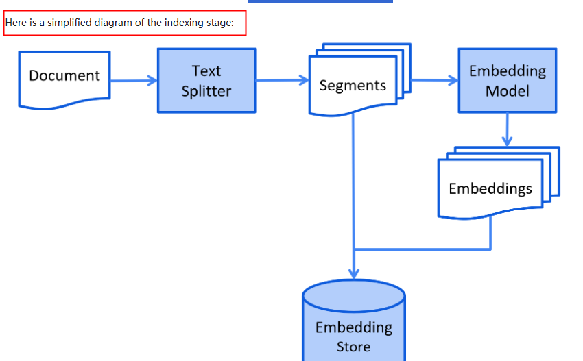
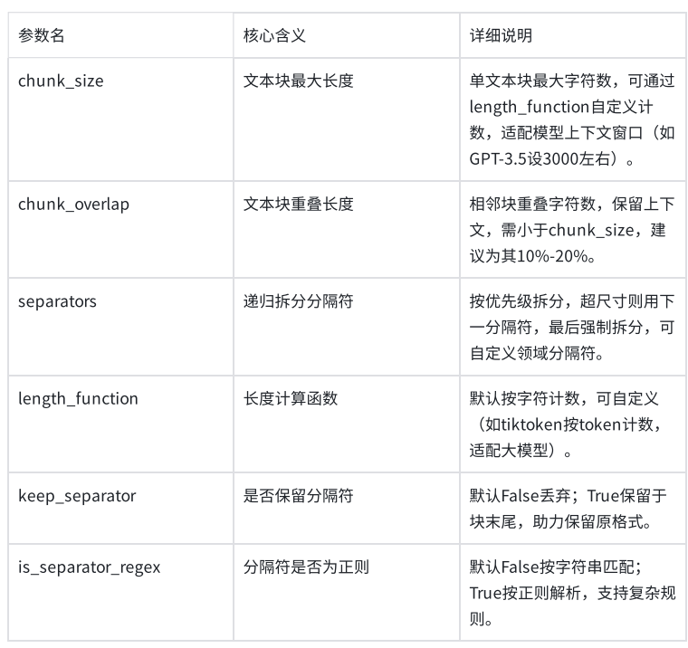

# 检索增强生成RAG

## RAG

通俗讲就是一个外挂的知识库,让大模型能看一看防止出现幻觉

RAG技术就像给AI大模型装上了「实时百科大脑」，为了让大模型获取足够的上下文，以便获得更加广泛的信息源，通过先查资料后回答的机制，让AI摆脱传统模型的”知识遗忘和幻觉回复”困境

通过引入外部知识源来增强LLM的输出能力，传统的LLM通常基于其训练数据生成响应，但这些数据可能过时或不够全面。RAG允许模型在生成答案之前，从特定的知识库中检索相关信息，从而提供更准确和上下文相关的回答

### RAG使用方法

总体来说RAG的主要流程是索引和检索Index,Retrieval

#### 索引

**通俗来讲就是把文档切成一块一块存入库中**




#### 检索

**通过用户提问在库中,对比相似度查找资料,对着资料回答**





## RAG标准流程(重点)

1.在准备阶段,通过文档工具把文档变成langchain中的文档对象

**在RAG准备阶段，LangChain通过文档加载器对各种格式的文档进行加载，转换为LangChain中的文档对象**

2.之后把文档对象切成一块一块

**对文档对象进行分割，根据分割规则，分割成文档片段**

3.把切片的文档对象通过嵌入模型存入向量数据库

**将文档片段通过文本嵌入模型组件，转换为向量，通过向量数据库组件，保存到向量数据库**

4.在使用时,用户提问,将提问的问题切成片段,用这些片段来找向量数据库中的相似数据,返回相关数据

**在RAG的使用阶段，用户首先提出问题，使用文本嵌入模型组件，将提问文本转换为向量数据，通过向量数据库检索器组件，进行相似性检索，返回关联的文本片段**

5.大模型根据相关数据回答问题

**将相关的文档片段内容渲染到提示词模板中，作为提问问题的上下文传递给大模型，在上下文里做“阅读-理解-整合-生成”，最后把整理好的答案返回给用户**

总结:把接收到的文档通过文档对象切片存入向量数据库,在提问词切成片段找相似的文档切片返回.大模型回答问题

**RAG的核心卖点正是让生成模型利用检索到的外部知识再做一次深加工，从而给出连贯、准确且带引用的回答**

## 文档加载器

完整代码

```python
from langchain_community.document_loaders import TextLoader
file_url=r"D:\develop\LangChain\检索增强生成RAG\assets\sample.txt"
encoding = "utf-8"

docs= TextLoader(file_url, encoding).load()
print(docs)
```

格式都大差不差

别的格式就修改下面两行

```python
from langchain_community.document_loaders import TextLoader
...
docs= TextLoader(file_url, encoding).load()
```

## 文本分割器

为了节省token和避免无法接受大量数据的问题使用文本分割器

#### 常用分割器

RecursiveCharacterTextSplitter递归按字符分割文本

TokenTextSplitter按照token数量分割

**函数**

split_text()：将文本字符串分割成字符串列表
split_documents()：将Document对象列表分割成更小文本片段的Document对象列表
create_documents()：通过字符串列表创建Document对象

#### 核心参数



使用split_text()方法进行文本分割

完整代码

```python
from langchain_text_splitters import RecursiveCharacterTextSplitter
from langchain_core.documents import Document

content = (
    "大模型RAG（检索增强生成）是一种结合生成模型与外部知识检索的技术，通过从大规模文档或数据库中检索相关信息，"
    "辅助生成模型以提升回答的准确性和相关性。其核心流程包括用户输入查询、系统检索相关知识、"
    "生成模型基于检索结果生成内容，并输出最终答案。RAG的优势在于能够弥补生成模型的知识盲区，"
    "提供更准确、实时和可解释的输出，广泛应用于问答系统、内容生成、客服、教育和企业领域。"
    "然而，其也面临依赖高质量知识库、可能的响应延迟、较高的维护成本以及数据隐私等挑战。")


text_solitter= RecursiveCharacterTextSplitter(
    chunk_size= 100,
    chunk_overlap= 30,
    length_function=len
)#创造文本分割器对象

sp1= text_solitter.split_text(content)
sp_doc= [Document (page_content=text) for text in sp1]
full_text= ""
for text in sp1:
    if full_text:
        full_text += text[30:]
    else:
        full_text += text
print(f"原始文本大小：{len(content)}，原始内容：\n{content}\n")
print(f"分割文档数量：{len(sp_doc)}\n")
for idx, splitter_document in enumerate(sp_doc, 1):
    print(f"第{idx}个文档 - 大小：{len(splitter_document.page_content)}, 内容：{splitter_document.page_content}\n")

# 最终完整性验证
print(f"拼接后文本大小：{len(full_text)}")
print(f"是否与原始文本完全一致：{full_text == content}")
print(f"拼接后完整内容：\n{full_text}")
```

拼接原本文本

```python
full_text= ""
for text in sp1:
    if full_text:
        full_text += text[30:]
    else:
        full_text += text
```

创造对象使用方法

```python
text_solitter= RecursiveCharacterTextSplitter(
    chunk_size= 100,
    chunk_overlap= 30,
    length_function=len
)

sp1= text_solitter.split_text(content)
```

## (小项目)AI智能运维

投给大模型RAG让大模型回答特定处理

某系统涉及后续自动化维护，需要根据响应码让大模型启动自迭代/自维护模式

完整代码

```python
from langchain_community.document_loaders import Docx2txtLoader
from langchain_community.embeddings import DashScopeEmbeddings
from langchain.chat_models import init_chat_model
from langchain_core.prompts import  PromptTemplate
from langchain_core.runnables import RunnablePassthrough
from langchain_text_splitters import CharacterTextSplitter
from langchain_community.vectorstores import Redis
model = init_chat_model(
    model="deepseek-v4-pro",
    model_provider="openai",
    api_key="sk-9f31cd1eecca4ac884e7679f0e15d40b",
    base_url="https://api.deepseek.com"
)
prompt_template = """
    请使用以下提供的文本内容来回答问题。仅使用提供的文本信息，
    如果文本中没有相关信息，请回答"抱歉，提供的文本中没有这个信息"。

    文本内容：
    {context}

    问题：{question}

    回答：
    "
"""

prompt= PromptTemplate(
    template=prompt_template,
    input_variables=["context", "question"]
)
embedding= DashScopeEmbeddings(
    model="text-embedding-v3",
    dashscope_api_key="sk-14fd29f4451449cbb013458844d60fa3"
)

doc= Docx2txtLoader(r"D:\develop\LangChain\检索增强生成RAG\alibaba-java.docx").load()

split1= CharacterTextSplitter(chunk_size=1000, chunk_overlap=0, length_function=len)

txet1= split1.split_documents(doc)
print("文档个数",len(txet1))

vector = Redis.from_documents(
    documents=txet1,
    embedding=embedding,
    redis_url="redis://localhost:26379",
    index_name="my_index3")
retriever= vector.as_retriever(search_kwargs={"k": 2})


rag_chain= ({"context": retriever,
            "question": RunnablePassthrough()}|prompt|model)

question = "00000和A0001分别是什么意思"
result = rag_chain.invoke(question)
print("\n问题:", question)
print("\n回答:", result.content)
```

主要逻辑 首先调用大模型和创造提示词,再创造嵌入式模型对象载入要使用的文档,再将文档切片存入向量数据库,创造链,创造结果

```python
retriever= vector.as_retriever(search_kwargs={"k": 2})
```

返回最相关的两个文档