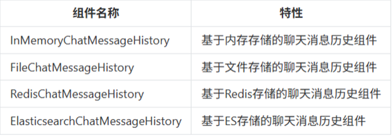

# 记忆缓存

大模型的记忆功能,记住之前的对话

记忆缓存是聊天系统中的一个重要组件，用于存储和管理对话的上下文信息。它的主要作用是让AI助手能够”记住”之前的对话内容，从而提供连贯和个性化的回复。

常用消息记忆组件



更推荐Redis和Elasticsearch

## 内存储存记忆

```python
prompt = ChatPromptTemplate.from_messages([
    # 用于插入历史消息
    MessagesPlaceholder(variable_name="history"),
    ("human", "{input}")
])

parser = StrOutputParser()
# 构建处理链：将提示词模板、语言模型和输出解析器组合
chain = prompt | llm | parser
# 创建内存聊天历史记录实例，用于存储对话历史
history = InMemoryChatMessageHistory()
# 创建带消息历史的可运行对象，用于处理带历史记录的对话
runnable = RunnableWithMessageHistory(
    chain,
    get_session_history=lambda session_id: history,
    input_messages_key="input",  # 指定输入键
    history_messages_key="history"  # 指定历史消息键
)
# 清空历史记录
history.clear()
# 配置运行时参数，设置会话ID
config = RunnableConfig(configurable={"session_id": "user-001"})

logger.info(runnable.invoke({"input": "我叫张三，我爱好学习。"}, config))
logger.info(runnable.invoke({"input": "我叫什么？我的爱好是什么？"}, config))
```

不重要

## 持久化

### 用redisStack作为存储

RedisStack = 原生Redis + 搜索 + 图 + 时间序列 + JSON + 概率结构 + 可视化工具 + 开发框架支持

创建会话历史的方法

```python
def get_session_history(session_id: str) -> RedisChatMessageHistory:
    """获取或创建会话历史（使用 Redis）"""
    # 创建 Redis 历史对象
    history = RedisChatMessageHistory(
        session_id=session_id,
        url=REDIS_URL,
        # ttl=3600  # 注释：关闭自动过期，避免重启后数据被清理
    )

    return history
```

创建带历史的链

```python
# 创建带历史的链
chain = RunnableWithMessageHistory(
    prompt | llm,
    get_session_history,
    input_messages_key="question",
    history_messages_key="history"
)
```

```python
# 配置
# session_id 就是登录大模型的各自帐户，类似登录手机号码，各不相同
config = RunnableConfig(configurable={"session_id": "user-001"})
```

```python
# 主循环
print("开始对话（输入 'quit' 退出）")
while True:
    question = input("\n输入问题：")
    if question.lower() in ['quit', 'exit', 'q']:
        break

    response = chain.invoke({"question": question}, config)
    logger.info(f"AI回答:{response.content}")

    # 等同于redis-cli的SAVE命令，强制写入dump.rdb
    redis_client.save()
```
