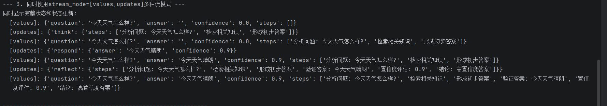
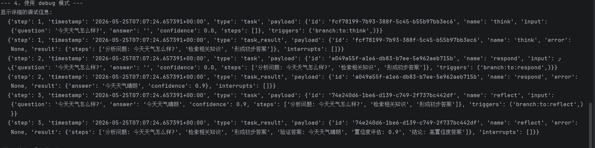
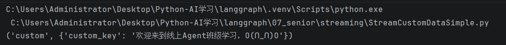
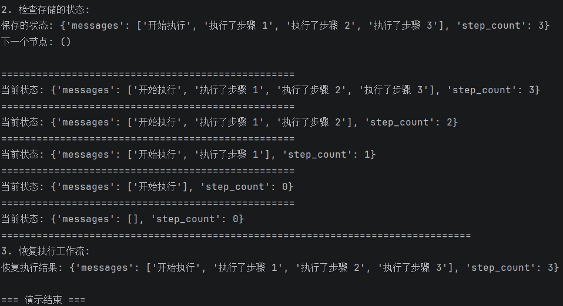
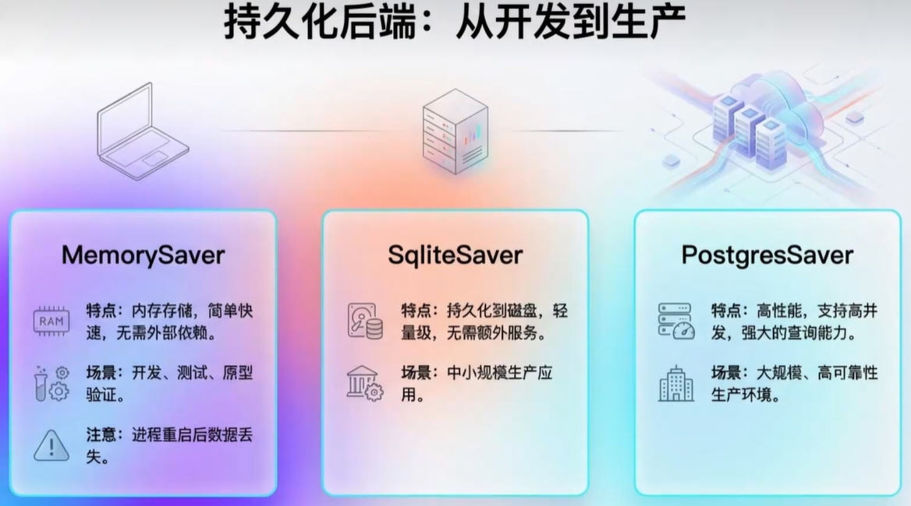
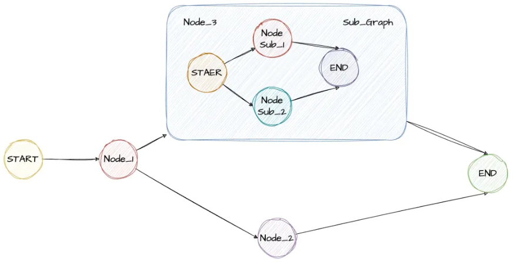

# 高级特性之流式处理(Streaming)

主要作用是可以输出工作的过程,更方便检查和更加流畅运行

**LangGraph 里的 “流式传输” 功能，核心就是让 AI 应用（比如用大语言模型做的工具、对话机器人）能 “实时输出结果”，**
**不用等整个流程跑完，体验更流畅。**

------

********langchain流式输出，它主要是处理回复的长篇文字信息内容；** 
**langgraph流式输出，实时看流程状态**

------

LangGraph有stream（同步）和astream（异步）方法，以迭代器的形式生成流式输出。

## 流图状态(Stream graph state)

**使用流模式，并在图执行时流式传输其状态。updates  values**
**updates在图的每一步后，将更新流向状态。**
**values在图的每一步后，流出状态的全部值。**

```python
for chunk in graph.stream({"topic": "ice cream"},stream_mode="updates"):
    print(chunk)
```

会流出更新的数据值

```python
for chunk in graph.stream({"topic": "ice cream"},stream_mode="values"):
    print(chunk)
```

values在图的每一步后，流出状态的全部值。

## 多模式流+debug模式并存(Stream multiple mdes)

**将列表作为stream_mode参数传递，以同时流式传输多种模式。**

**流式输出将是(mode, chunk)形式的元组，其中mode是流模式的名称，chunk是该模式所流式传输的数据。**

```python
for mode, chunk in graph.stream(input_state, stream_mode=["values", "updates"]):
    print(f"  [{mode}]: {chunk}")
```

两种输出一条一行输出



debug模式

```python
print("--- 4. 使用 debug 模式 ---")
print("显示详细的调试信息:")
try:
    for chunk in graph.stream(input_state, stream_mode="debug"):
        print(f"  {chunk}")
except Exception as e:
    print(f"  Debug模式可能需要特殊配置: {e}")
```

输出很详细

--- 4. 使用 debug 模式 ---
显示详细的调试信息:
  {'step': 1, 'timestamp': '2026-05-25T07:07:24.657391+00:00', 'type': 'task', 'payload': {'id': 'fcf78199-7b93-388f-5c45-b55b97bb3ec6', 'name': 'think', 'input': {'question': '今天天气怎么样?', 'answer': '', 'confidence': 0.0, 'steps': []}, 'triggers': ('branch:to:think',)}}
  {'step': 1, 'timestamp': '2026-05-25T07:07:24.657391+00:00', 'type': 'task_result', 'payload': {'id': 'fcf78199-7b93-388f-5c45-b55b97bb3ec6', 'name': 'think', 'error': None, 'result': {'steps': ['分析问题: 今天天气怎么样?', '检索相关知识', '形成初步答案']}, 'interrupts': []}}
  {'step': 2, 'timestamp': '2026-05-25T07:07:24.657391+00:00', 'type': 'task', 'payload': {'id': 'a049a55f-a1e6-db83-b7ee-5e962aeb715b', 'name': 'respond', 'input': {'question': '今天天气怎么样?', 'answer': '', 'confidence': 0.0, 'steps': ['分析问题: 今天天气怎么样?', '检索相关知识', '形成初步答案']}, 'triggers': ('branch:to:respond',)}}
  {'step': 2, 'timestamp': '2026-05-25T07:07:24.657391+00:00', 'type': 'task_result', 'payload': {'id': 'a049a55f-a1e6-db83-b7ee-5e962aeb715b', 'name': 'respond', 'error': None, 'result': {'answer': '今天天气晴朗', 'confidence': 0.9}, 'interrupts': []}}
  {'step': 3, 'timestamp': '2026-05-25T07:07:24.657391+00:00', 'type': 'task', 'payload': {'id': '74e240d6-1be6-d139-c749-2f737bc442df', 'name': 'reflect', 'input': {'question': '今天天气怎么样?', 'answer': '今天天气晴朗', 'confidence': 0.9, 'steps': ['分析问题: 今天天气怎么样?', '检索相关知识', '形成初步答案']}, 'triggers': ('branch:to:reflect',)}}
  {'step': 3, 'timestamp': '2026-05-25T07:07:24.657391+00:00', 'type': 'task_result', 'payload': {'id': '74e240d6-1be6-d139-c749-2f737bc442df', 'name': 'reflect', 'error': None, 'result': {'steps': ['分析问题: 今天天气怎么样?', '检索相关知识', '形成初步答案', '验证答案: 今天天气晴朗', '置信度评估: 0.9', '结论: 高置信度答案']}, 'interrupts': []}}



## LLM令牌(LLM tokens)

**使用messages流模式，从图中的任何部分（包括节点、工具、子图或任务）逐token流式传输大型语言模型（LLM）的输出。**
**messages模式的流式输出是一个元组(message_chunk, metadata)，其中：**
**Ø message_chunk：来自大语言模型（LLM）的令牌或消息片段。**
**Ø metadata：一个包含图节点和大语言模型调用详情的字典。**

案例完整代码

```python
'''
StreamLLMTokens.py

使用messages流模式，从图中的任何部分（包括节点、工具、子图或任务）逐token流式传输大型语言模型（LLM）的输出。
messages模式的流式输出是一个元组(message_chunk, metadata)，其中：
   message_chunk：来自大语言模型（LLM）的令牌或消息片段。
   metadata：一个包含图节点和大语言模型调用详情的字典元数据。

'''

from typing import TypedDict
from langgraph.graph import StateGraph,START
from langchain.chat_models import init_chat_model
import os


class State(TypedDict):
    query:str
    answer:str

def node(state:State):
    print("开始调用node节点")

    model = init_chat_model(model="qwen-plus",
                            model_provider="openai",
                            api_key=os.getenv("aliQwen-api"),
                            base_url="https://dashscope.aliyuncs.com/compatible-mode/v1")

    llm_result = model.invoke( [("user",state["query"])] )
    print("llm invoke结束",end="\n\n")

    return {"answer":llm_result}

def main():
    graph = (
        StateGraph(state_schema=State)
        .add_node(node)
        .add_edge(START,"node")
        .compile()
    )

    inputs = {"query":"帮我生成一个200字的小学生作文，主题为我的一天"}

    # stream_mode="messages"从任何调用了大语言模型的图节点流式传输二元组（大语言模型token，元数据）。
    '''messages模式的流式输出是一个元组(message_chunk, metadata)，其中：
        message_chunk：来自大语言模型（LLM）的令牌或消息片段。
        metadata：一个包含图节点和大语言模型调用详情的字典元数据。'''
    for chunk,meta_data in graph.stream(inputs,stream_mode="messages"):
        #print(f"type of chunk:{type(chunk)}")#上课时候打开注释
        print(chunk.content,end="")
        #print(chunk,end="")

if __name__ == '__main__':
    main()
```

------

------

```python
for chunk,meta_data in graph.stream(inputs,stream_mode="messages"):
    #print(f"type of chunk:{type(chunk)}")#上课时候打开注释
    print(chunk.content,end="")
    #print(chunk,end="")
```

chunk的类型是AIMessage对象我们要的是content

输出为一块一块输出

## 流式传输自定义数据StreamCustomData

 **要从LangGraph节点或工具内部发送自定义用户定义数据，请遵循以下步骤：**
**Ø 使用get_stream_writer访问流写入器并发送自定义数据。**
**Ø 调用.stream()或.astream()时，设置stream_mode="custom"以在流中获取自定义数据。你可以组合多种模式（例如["updates", "custom"]），但至少有一种模式必须是"custom"。**

```python
def node(state: State):
    # Get the stream writer to send custom data
    writer = get_stream_writer()
    # Emit a custom key-value pair (e.g., progress update)
    writer({"custom_key": "欢迎来到线上Agent班级学习，O(∩_∩)O"})
    return {"answer": "some data"}
```

写入的自定义的数据

```python
for chunk in graph.stream({"query": "example"}, stream_mode=["custom"]):
    print(chunk)
```



# 高级特性之状态持久化(Persistence）

将程序运行过程中的数据保存起来

------


**状态持久化指的是在程序运行时将瞬间的状态保存下来，以便后续需要的时候能够重新恢复执行，用于解决因为程序退出、重启等事件而丢失任务。在 LangGraph 如果使用了持久化，工作流执行的每个步骤结束后，系统会自动将当前整个图的状态（包括所有变量、历史消息、下一步要执行的节点等信息）完整地保存下来，这份存档就是一个检查点（Checkpoint），LangGraph支持存储在内存、Redis、DB等存储介质中。**

**检查点通过thread_id（会话id，不是操作系统中的线程id）区分不同的会话，后续重新执行时会使用。**
**使用检查点调用图时，必须在配置的可配置部分指定thread_id。**
**{"configurable": {"thread_id": "user-001"}}**

 

------

 

##  短期记忆

 短期记忆（Checkpointer）

载体：Checkpointer（MemorySaver、RedisSaver、PostgresSaver…）
作用：把每轮消息 + 工具调用结果序列化成图状态，按 thread_id 持久化；下次传入相同 thread_id 自动续写。

原理：

每次你调用 graph.invoke(...) 或 graph.stream(...)，LangGraph 都会维护一个状态（state）。
如果没有 Checkpointer，这个 state 默认只存在本次调用内，调用结束就丢掉了。
如果启用了 Checkpointer，
它会把 state 保存到存储中（内存/数据库/文件），下次继续调用时，可以恢复之前的 state，实现“记忆”。

## 长期记忆

载体：BaseStore（InMemoryStore、RedisStore、AsyncPostgresStore…）
作用：显式保存“用户偏好”“背景事实”等高密度信息，由 LLM 主动读写；Store 支持向量检索，支持命名空间隔离。

和 Checkpointer 的区别：

Checkpointer：保存图的运行状态（短期记忆，主要用于同一个线程连续对话）。

Store：LangGraph的存储模块提供持久化的键值存储，支持跨线程和会话的长期内存，适用于需持久化数据的复杂工作流。

## 内存检查点

```python
graph = create_graph()
app = graph.compile(checkpointer=InMemorySaver())

# 配置线程ID用于存储状态
config = {"configurable": {"thread_id": "user_13811112222"}}

print("1. 首次执行工作流:")
result = app.invoke({
    "messages": ["开始执行"],
    "step_count": 0
}, config)
```

核心在于

```python
app = graph.compile(checkpointer=InMemorySaver())
config = {"configurable": {"thread_id": "user_13811112222"}}
```

将信息存入"thread_id": "user_13811112222"这个用户中

```python
print("1. 首次执行工作流:")
result = app.invoke({
    "messages": ["开始执行"],
    "step_count": 0
}, config)

print(f"执行结果result: {result}\n")
```

首次执行

```python
print("2. 检查存储的状态:")
saved_state = app.get_state(config)
print(f"保存的状态: {saved_state.values}")
print(f"下一个节点: {saved_state.next}\n")

# 获取指定线程的完整执行历史（正序：从最早到最晚,第一步在栈底）
history = app.get_state_history(config)
# 遍历历史中的每一个检查点快照
for checkpoint in history:
    print("=" * 50)
    # 该时刻的完整State状态（最核心）
    print(f"当前状态: {checkpoint.values}")
```

存储的状态是栈数据类型的存储方式(先进后出)

```python
print("3. 恢复执行工作流:")
# 由于工作流已经完成，这里会直接返回最终结果
result2 = app.invoke(None, config)
print(f"恢复执行结果: {result2}\n")
```

还会执行



## 数据库检查点(sqlite)和智能体



```python
import sqlite3
from typing import TypedDict, Annotated, List
from langgraph.checkpoint.sqlite import SqliteSaver
from langgraph.graph import StateGraph, START, END, add_messages
from langchain.chat_models import init_chat_model
from langchain_core.messages import HumanMessage


# 定义状态
class GraphState(TypedDict):
    messages: Annotated[List, add_messages]


# 初始化大模型
llm = init_chat_model(
    model="qwen-plus",
    model_provider="openai",
    api_key="sk-14fd29f4451449cbb013458844d60fa3",
    base_url="https://dashscope.aliyuncs.com/compatible-mode/v1"
)


# 定义节点函数
def call_llm(state: GraphState):
    """调用大模型生成回复"""
    messages = state["messages"]
    response = llm.invoke(messages)
    return {"messages": [response]}


def main():
    print("=== LangGraph Agent + SQLite 演示 ===\n")

    # 1. 创建SQLite连接（连接到具体的.db文件）
    conn = sqlite3.connect("D:\\develop\\database\\langgraph_checkpoint.db", check_same_thread=False)

    # 2. 创建SqliteSaver用于保存对话历史
    sqliteDB = SqliteSaver(conn)

    # 3. 构建LangGraph工作流
    builder = StateGraph(GraphState)

    # 添加节点
    builder.add_node("agent", call_llm)

    # 添加边
    builder.add_edge(START, "agent")
    builder.add_edge("agent", END)

    # 4. 编译图并添加checkpoint保存器
    graph = builder.compile(checkpointer=sqliteDB)

    # 5. 使用配置（thread_id用于区分不同会话）
    config = {"configurable": {"thread_id": "conversation_1"}}

    # 6. 第一次对话
    print("用户:我是小明")
    result1 = graph.invoke(
        {"messages": [HumanMessage(content="我是小明")]},
        config=config
    )
    print(f"助手: {result1['messages'][-1].content}\n")

    # 7. 继续对话（会自动加载历史记录）
    print("用户: 我是谁")
    result2 = graph.invoke(
        {"messages": [HumanMessage(content="我是谁")]},
        config=config
    )
    print(f"助手: {result2['messages'][-1].content}\n")

    # 8. 查看对话历史
    print("=== 对话历史 ===")
    for message in result2["messages"]:
        print(f"{message.type}: {message.content}")

    # 9. 关闭数据库连接
    conn.close()
    print("\n=== 演示结束 ===")


if __name__ == "__main__":
    main()
```

我使用SQLite数据库来连接智能体

```python
# 1. 创建SQLite连接（连接到具体的.db文件）
conn = sqlite3.connect("D:\\develop\\database\\langgraph_checkpoint.db", check_same_thread=False)
# 2. 创建SqliteSaver用于保存对话历史
sqliteDB = SqliteSaver(conn)
```

连接数据库

```python
graph = builder.compile(checkpointer=sqliteDB)
```

保存对话历史

```python
config = {"configurable": {"thread_id": "conversation_1"}}
```

保存在conversation_1中

# 高级特性之时间回溯(Time-Travel)

可以在某个节点改变下一步的运行

**在处理基于模型做决策的非确定性系统（例如由大语言模型驱动的智能体）时，详细检查它们的决策过程可能会很有用：**
**（1）理解推理过程：分析达成成功结果的各个步骤。**
**（2）调试错误：确定错误发生的位置和原因。**
**（3）探索替代方案：测试不同的路径以发现更好的解决方案。**
**LangGraph 提供了时间回溯功能来支持这些使用场景。具体来说，可以从之前的检查点恢复执行——<u>要么重放相同的状态，要么对其进行修改以探索其他可能性</u>。在所有情况下，恢复过去的执行都会在历史记录中<u>产生一个新的分支</u>。**

------

**LangGraph的时间旅行，是一个允许你“回到对话的某个历史状态点，并从那里重新执行”的功能。就是用来回溯、检查、修改一个工作流执行过程中的历史状态，并从某个历史节点重新执行，从而实现对智能体决策过程的调试、分析和路径探索。**
**它依赖 Checkpointer（检查点系统），比如 MemorySaver、数据库持久化 saver 等，把每一步执行的 状态（state） 保存下来。**

------

使用场景

1.调试：想看 agent 在某个历史状态下会如何响应

2.修复：发现某一步错误，可以回到那一步，重新走另一条路径

3.探索分支：从同一个历史状态，分叉出多个可能的结果，做 what-if 实验

4.人类反馈 (HITL)：如果用户拒绝了工具调用，可以退回到之前状态，重新走对话

```python
import uuid
from typing_extensions import TypedDict, NotRequired
from langgraph.graph import StateGraph, START, END
from langgraph.checkpoint.memory import MemorySaver
from langgraph.checkpoint.memory import InMemorySaver


class StoryState(TypedDict):
    """故事状态定义"""
    character: NotRequired[str]  # character（角色/人物）
    setting: NotRequired[str]    # setting（场景/背景）
    plot: NotRequired[str]       # plot（情节/剧情）
    ending: NotRequired[str]     # ending（结局/结尾）


def create_character(state: StoryState):
    """
    创建故事角色
    Args:
        state: 当前状态
    Returns:
        dict: 更新后的状态
    """
    print("执行节点: create_character")

    # 模拟LLM调用
    mock_character = "一只会说话的猫"
    print(f"创建的角色: {mock_character}")
    return {"character": mock_character}


def set_setting(state: StoryState):
    """
    设置故事背景
    Args:
        state: 当前状态
    Returns:
        dict: 更新后的状态
    """
    print("执行节点: set_setting")

    # 模拟LLM调用
    mock_setting = "在一个神秘的图书馆里"
    print(f"设置的背景: {mock_setting}")
    return {"setting": mock_setting}


def develop_plot(state: StoryState):
    """
    发展故事情节
    Args:
        state: 当前状态
    Returns:
        dict: 更新后的状态
    """
    print("执行节点: develop_plot")

    # 模拟LLM调用
    character = state.get("character", "未知角色")
    setting = state.get("setting", "未知背景")
    mock_plot = f"{character}在{setting}发现了一本会发光的书"
    print(f"发展的剧情: {mock_plot}")
    return {"plot": mock_plot}


def write_ending(state: StoryState):
    """
    编写故事结局
    Args:
        state: 当前状态
    Returns:
        dict: 更新后的状态
    """
    print("执行节点: write_ending")

    # 模拟LLM调用
    plot = state.get("plot", "未知剧情")
    mock_ending = f"当{plot}时，整个图书馆都被魔法光芒照亮了"
    print(f"编写的结局: {mock_ending}")
    return {"ending": mock_ending}


def main():
    """主函数 - 演示高级时间旅行功能"""
    print("=== LangGraph 高级时间旅行演示 ===\n")

    # 构建工作流
    workflow = StateGraph(StoryState)

    # 添加节点
    workflow.add_node("create_character", create_character)
    workflow.add_node("set_setting", set_setting)
    workflow.add_node("develop_plot", develop_plot)
    workflow.add_node("write_ending", write_ending)

    # 添加边来连接节点
    workflow.add_edge(START, "create_character")
    workflow.add_edge("create_character", "set_setting")
    workflow.add_edge("set_setting", "develop_plot")
    workflow.add_edge("develop_plot", "write_ending")
    workflow.add_edge("write_ending", END)

    # 编译
    graph = workflow.compile(checkpointer=InMemorySaver())

    # 1. 运行图表生成第一个故事
    print("1. 生成第一个故事...")
    config1 = {
        "configurable": {
            "thread_id": str(uuid.uuid4()),
        }
    }

    story1 = graph.invoke({}, config1)
    print(f"角色: {story1['character']}")
    print(f"背景: {story1['setting']}")
    print(f"剧情: {story1['plot']}")
    print(f"结局: {story1['ending']}")
    print("话痨猫-图书馆-发光书-魔法亮")
    print()

    # 2. 查看历史状态
    print("2. 查看第一个故事的历史状态...")
    states1 = list(graph.get_state_history(config1))

    print("历史状态:")
    for i, state in enumerate(states1):
        print(f"  {i}. 下一步节点: {state.next}")
        print(f"     检查点ID: {state.config['configurable']['checkpoint_id']}")
        if state.values:
            print(f"     状态值: {state.values}")
        print()

    # 3. 从中间状态恢复执行，创建第二个故事
    print("3. 从中间状态恢复执行，创建第二个故事...")

    # 选择create_character执行后的状态
    # 3. 下一步节点: ('set_setting',)
    #  检查点ID: 1f103431-a499-650f-8001-b96045a4ed87
    #  状态值: {'character': '一只会说话的猫'}
    character_state = states1[2]  # 索引2对应create_character执行后的状态
    print(f"选中的状态: {character_state.next}")
    print(f"选中的状态值: {character_state.values}")

    # 更新状态，改变角色
    new_config = graph.update_state(
        character_state.config,
        values={"character": "一只会飞的龙"}
    )
    print(f"新配置: {new_config}")
    print()

    # 4. 从新检查点恢复执行
    print("4. 从新检查点恢复执行，生成第二个故事...")
    story2 = graph.invoke(None, new_config)
    print(f"新角色: {story2['character']}")
    print(f"背景: {story2['setting']}")
    print(f"剧情: {story2['plot']}")
    print(f"结局: {story2['ending']}")
    print()

    # 5. 比较两个故事
    print("5. 比较两个故事:")
    print("  故事1:")
    print(f"    角色: {story1['character']}")
    print(f"    背景: {story1['setting']}")
    print(f"    剧情: {story1['plot']}")
    print(f"    结局: {story1['ending']}")
    print()

    print("  故事2:")
    print(f"    角色: {story2['character']}")
    print(f"    背景: {story2['setting']}")
    print(f"    剧情: {story2['plot']}")
    print(f"    结局: {story2['ending']}")
    print()

    print("=== 演示完成 ===")


if __name__ == "__main__":
    main()
```

以上为案例代码

```python
config1 = {
    "configurable": {
        "thread_id": str(uuid.uuid4()),
    }
}
```

id是唯一的数

```python
character_state = states1[2]  # 索引2对应create_character执行后的状态
print(f"选中的状态: {character_state.next}")
print(f"选中的状态值: {character_state.values}")

# 更新状态，改变角色
new_config = graph.update_state(
    character_state.config,
    values={"character": "一只会飞的龙"}
)
print(f"新配置: {new_config}")
print()
```

根据唯一id改成新配置

```python
story2 = graph.invoke(None, new_config)
```

生成新故事

# 高级特性之子图(Subgraphs)

在LangGraph中允许将一个完整的图作为另一个图的节点，适用于将复杂的任务拆解为多个专业智能体协同完成，每个子图都可以独立开发、测试并且可以复用。每个子图都可以拥有自己的私有数据，也可以与父图共享数据。

 

```python
# 创建子图构建器并配置节点和边
subgraph_builder = StateGraph(AtguiguState)
subgraph_builder.add_node("sub_node", sub_node)

subgraph_builder.add_edge(START, "sub_node")
subgraph_builder.add_edge("sub_node", END)
subgraph = subgraph_builder.compile()
```

创建子图

```python
builder = StateGraph(AtguiguState)
builder.add_node("subgraph_node", subgraph)
builder.add_edge(START, "subgraph_node")
builder.add_edge("subgraph_node", END)

# 编译主图并绘制结构图
graph = builder.compile()
print(graph.invoke({"messages": ["main-graph"]}))
```

会输出{'messages': ['main-graph', 'main-graph', 'response from subgraph']}

有两个'main-graph'因为langgraph框架做了两次并行处理,就是主图把'main-graph'传给子图输出'main-graph', 'response from subgraph'但是主图又做了一次就输出{'messages': ['main-graph', 'main-graph', 'response from subgraph']}

#### 跨图状态交互

```python
# 父图状态：仅包含用户查询和最终答案（与子图状态完全不同）
class ParentState(TypedDict):
    user_query: str  # 父图独有：用户输入的查询
    final_answer: str | None  # 父图独有：子图处理后的最终结果

# 子图状态：专注于分析逻辑（与父图状态无重叠字段）
class SubgraphState(TypedDict):
    analysis_input: str  # 子图独有：分析输入
    analysis_result: str  # 子图独有：分析结果
    intermediate_steps: list  # 子图独有：中间步骤（私有数据）
```

定义子图和父图属性

```python
def subgraph_analysis_node(state: SubgraphState) -> SubgraphState:
    """子图核心节点：处理分析逻辑，生成结果"""
    # 模拟子图的分析过程
    query = state["analysis_input"]
    state["intermediate_steps"] = [f"解析查询：{query}", "执行分析逻辑", "生成结果"]
    state["analysis_result"] = f"针对「{query}」的分析结果：这是子图处理后的内容"
    return state


def build_subgraph() -> StateGraph:
    """构建并编译子图"""
    sub_builder = StateGraph(SubgraphState)
    sub_builder.add_node("subgraph_analysis_node", subgraph_analysis_node)

    sub_builder.add_edge(START, "subgraph_analysis_node")
    sub_builder.add_edge("subgraph_analysis_node", END)
    return sub_builder.compile()


# 提前编译子图（供父图代理节点调用）
compiled_subgraph = build_subgraph()
```

制作子图节点函数

```python
def call_subgraph_proxy(state: ParentState) -> ParentState:
    """
    父图的代理节点：
    1. 将父图状态转换为子图所需的输入格式
    2. 手动调用子图
    3. 将子图输出映射回父图状态
    """

    # 步骤1：父图状态 → 子图输入（状态转换）,提取父图的user_query，转换为子图需要的analysis_input
    subgraph_input = {
        "analysis_input": state["user_query"],
        "intermediate_steps": [],  # 初始化子图的私有字段
        "analysis_result": ""  # 初始化子图结果字段
    }

    # 步骤2：手动调用编译后的子图，手动调用子图（而非直接将子图作为父图节点）
    subgraph_response = compiled_subgraph.invoke(subgraph_input)

    # 步骤3：子图输出 → 父图状态（结果映射）
    # 提取子图的analysis_result，赋值给父图的final_answer
    return {
        "user_query": state["user_query"],  # 保留父图原有字段
        "final_answer": subgraph_response["analysis_result"]
    }
```

此为父图调用子图的节点函数,首先将父图的数据转化成子图的数据,也就是步骤一,在步骤二 中调用子图得出来在子图中处理完返回的结果

最后一步把子图数据按照父图格式返回输出

```python
def build_parent_graph() -> StateGraph:
    """构建并编译父图（添加代理节点，而非直接添加子图）"""
    parent_builder = StateGraph(ParentState)
    # 添加代理节点（核心：手动处理状态转换+调用子图）
    parent_builder.add_node("call_subgraph_proxy", call_subgraph_proxy)
    # 父图执行链路：START → 代理节点 → END
    parent_builder.add_edge(START, "call_subgraph_proxy")
    parent_builder.add_edge("call_subgraph_proxy", END)
    return parent_builder.compile()
```

建造父图

```python
def main():
    """主函数：执行父图，验证跨图状态转换逻辑"""
    # 1. 构建父图
    parent_graph = build_parent_graph()

    # 2. 定义父图初始状态（仅包含user_query，符合父图状态结构）
    initial_state = {
        "user_query": "请分析Python中StateGraph的使用场景",
        "final_answer": None
    }
    print("父图初始状态：", initial_state)

    # 3. 执行父图，实际而言父图调用了call_subgraph_proxy
    final_state = parent_graph.invoke(initial_state)

    # 4. 输出结果
    print("\n父图最终状态：", final_state)
    print("\n子图处理后的最终答案：", final_state["final_answer"])
```

在主方法中传入的 "final_answer"是空,在进行处理之后处理出答案

父图最终状态： {'user_query': '请分析Python中StateGraph的使用场景', 'final_answer': '针对「请分析Python中StateGraph的使用场景」的分析结果：这是子图处理后的内容'}

子图处理后的最终答案： 针对「请分析Python中StateGraph的使用场景」的分析结果：这是子图处理后的内容